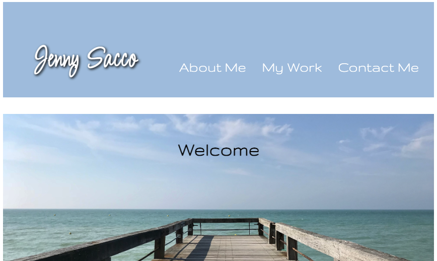

# Portfolio Page 
## <Project Portfolio>

## Table of Contents 

* [Description](#description)

* [LinkToSite](#LinkToSite)

* [Questions](#questions)

## Description

My Portfolio Page is here for you!
 
I wanted to make something easy for the user to navigate where they can get to know me a little better. 
 
You can read a bit more about me, navigate through my recent project links, visit my professional LinkedIn, read my resume, or contact me directly. 
 

## LinkToGithub
https://github.com/jennyrae818/Portfolio-page

## LinkToSite
https://jennyrae818.github.io/Portfolio-page/

## LinkToLinkedIn
https://www.linkedin.com/in/jenny-sacco-14024949/ 

## Questions

If you have any questions about the repo, open an issue or contact [Jenny](undefined) directly at jennyrae818@gmail.com.