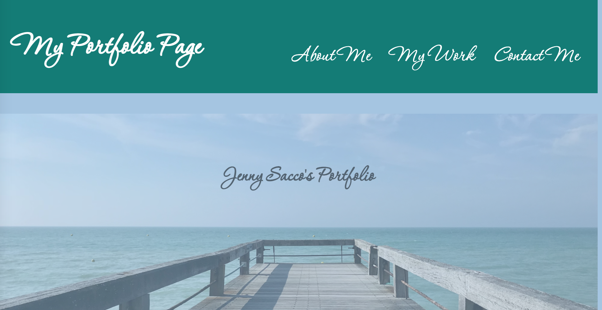

# Portfolio Page 
## <Project Portfolio>

## Table of Contents 

* [Description](#description)

* [LinkToSite](#LinkToSite)

* [Questions](#questions)

## Description

We were given the task make our own Portfolio page. The requirements included that it must have links to sections on the page with our previous work, an "about me" section, and our contact information. One of the images of our work must link to the page and the image must be larger than the others. Resizing must adjust to view on various devices. Since I do not have many deployed pages yet to-date, I've included one link/image and the remainder are place-holders for future work. I tried to make the page easy to read and elected for custom font and a color scheme that is pleasing to look at. I included "back to top" links to reduce unnecessary scrolling. I believe it's a good basis to work off of moving forward. 

Link to Github: https://github.com/jennyrae818/Portfolio-page

## LinkToSite
https://jennyrae818.github.io/Portfolio-page/

## Questions
none for this time around 

If you have any questions about the repo, open an issue or contact [Jenny](undefined) directly at jennyrae818@gmail.com.